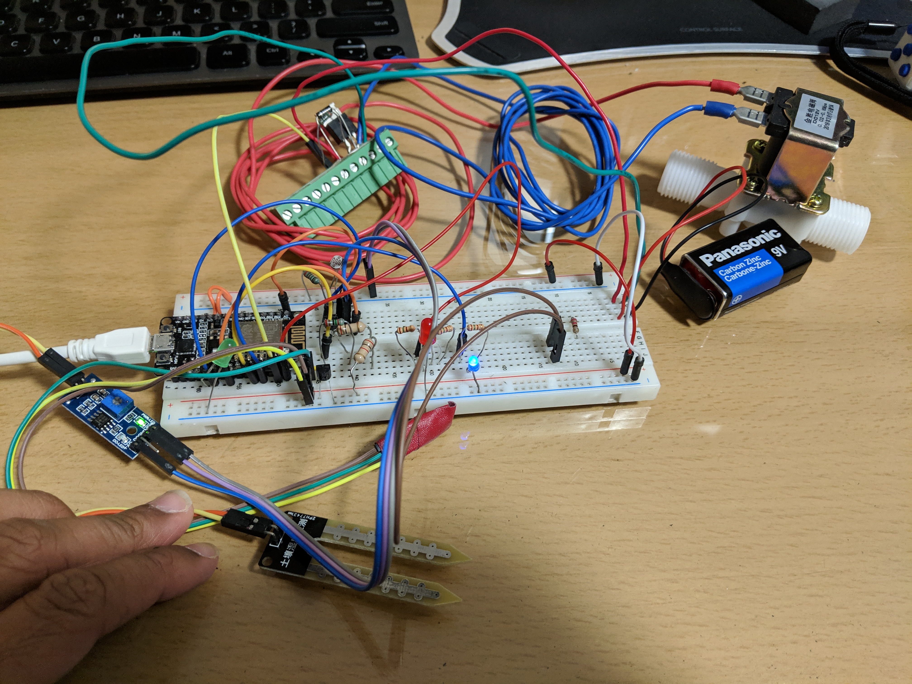
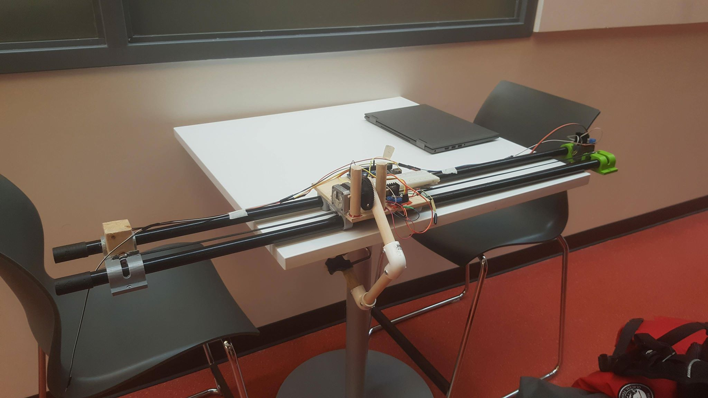

## About Me

I am currently doing my undergrad at McMaster University for Computer Engineering with the graduating class of 2021. I am a tech pioneer, who is always looking for new technologies to discover and try. Although my hobbies do include trying new techs, I also enjoy playing soccer, basketball, biking, cooking and having fun! I hope you find my portfolio interesting and if you have any questions please feel free to [email me](vithuran.sada@gmail.com).

## Skills

| Programming                                                            	| Hardware Development                              	| 3D modeling                       	|
|------------------------------------------------------------------------	|---------------------------------------------------	|-----------------------------------	|
| C++, C\#, C, Go, Python, Java, Mathlab, ReactJs, VueJs, HTML, CSS, Git 	| Pspice, Verilog, Simulink, Arduino, Raspberry Pie 	| Inventor, Solidworks, 3d printing 	|

## Work Experiences

### 05-08 2019 Full Stack Developer at Ellis Don

Helped bring two web applications to Alpha release. The two applications used React JS and Vue JS. These apps were deployed using Docker and Kubernetes on the Azure pipeline and optimized using Redis and Nginx. I also created two back-end services to store user data by using Java Spring and Go. We worked in a Scrum environment while using JIRA for project management. This Co-op experience was an eye opening experience due to the exposure to professional development and expectations. I learned a lot working with the various teams and hope to more my career foward by using this experience.

## Projects
Most of these are side projects which I have started on my own time and are a work in progress while other projects were done during hackathons or were unique projects which done in class. If you would like to learn more about the projects try clicking the project title to go to the project.

### [2019 IoT Garden Gnome](https://github.com/saamirt/IOT-Garden-Gnome)

This project started to help create a automated watering system for the garden in my backyard. Although we could have made a simple system to water the plants when soil moisture goes below a threshold, I believed it would be much more exciting to create a automated gardening system built on the NodeMCU, which measures soil moisture, soil and air temperature, and sunlight to determine the best time to water the garden while displaying all the information online. The Frontend(website) is built using React.Js can be found [here](https://github.com/saamirt/garden-gnome-app), and the hardware side written in C can be found [here](https://github.com/saamirt/IOT-Garden-Gnome). To communicate between them we are utlizing AWS IoT and Dynamo DB and Serverless Lambda functions to create a API to send data in real time from the garden sensors to the website. This API can be found [here](https://github.com/Vithop/gnome-app-api). With this we can check the status of the garden and send commands to water the garden through the air. Below you can see our first protoype of our hardware and if you follow the link to the Frontend you can also see the website. This project is still in developement so please stay tuned for newer developements!

### [2018 Whack-A-Mole](https://github.com/Vithop/Wack-A-Bok)

Arcade Style whack-a-mole in augmented reality. Uses Google ARcore and the Unity game engine to interact with the environment and do multiplayer gameplay in real-time. To learn more about this project please visit the [git repo.](https://github.com/Vithop/Wack-A-Bok)
 

### [2018 Firelytics](https://test1-fc794.firebaseapp.com/)

Marketing Analytic Software to optimize the design of marketable products using machine learning. Built during the Google Cloud Sprint Hackathon.
 
### [2018 Wearable BioSensor System](https://github.com/Mathuran/Myo_Arduino_3DLEDcube)

Used hand gesture control features of the Myo band to play a game on a LED Cube. Created during Delta-Hacks IV. This project did not have much perpose other than to explore the myo arm band technology.To communicate with the Myo band we used C# while the LED control was done in C. In my opinion it was a amazing piece of tech which can detect the eletrical signals in your arm and translate them into gestures, but it was not very reliable and needs improvment in accuracy and reliability. Currently the company which created the band has transformed into North and is developing AR glasses, so we won't be seeing much development in this anytime soon. Below is a gif demonstrating the gesture controlls manipulating the LEDs on the LED cube.

### 2017 Single Axis CNC with Robotic Arm

An arduino based Robotic Arm used to help remove clothes from a closet. This project was created by McMaster's 1P03 course to help a client complete the task of getting clothes from a closet with more independance, as the client had cerebal palsy. Through CADing and prototyping we achieved functional model of the machine. Below are the two protoypes which were developed during this project. The first prototype was built using Lego Mindstorm as it was robust enough to create a proof of concept. For the next prototype we went to 3D printing and wood to create the structure and used a arduino to control stepper motors. Due to time constraints our final prototype was not able to perform to all our requirments but with extra time the requirements would have easily been accomplished. This was a great learning experience for me as it taught me about time manegment, and scoping. 

## Contact Info

Feel free to contact me!

 647-444-4099

 vithuran.sada@gmail.com

 linkedin.com/in/vithuran-sada/
